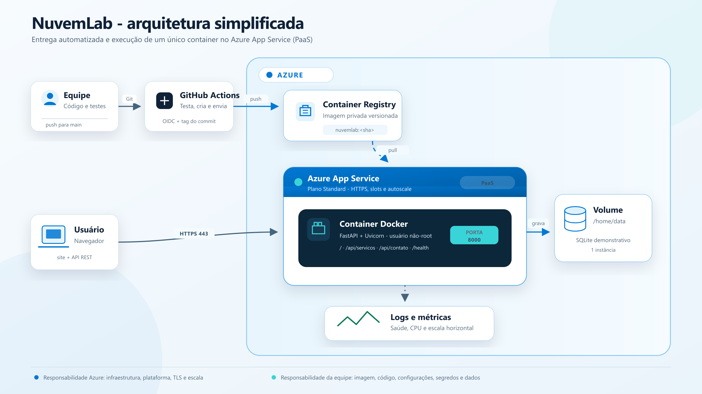

# Projeto Integrador com Docker e Nuvem

**Aplicação:** NuvemLab - página institucional e API REST simulada  

## Resumo executivo

O NuvemLab é uma aplicação institucional híbrida construída com Python e
FastAPI. A solução oferece uma página responsiva, o catálogo
`GET /api/servicos`, o recebimento de contatos por `POST /api/contato`, a
documentação OpenAPI em `/docs` e o health check `/health`. A aplicação é
empacotada em um container Docker e preparada para execução no Azure App
Service. A escolha principal é PaaS, pois transfere à plataforma a operação da
infraestrutura, do sistema operacional gerenciado, do balanceamento, do TLS e
da escala, enquanto a equipe mantém a imagem, o código, as configurações e os
dados.

## 1. Planejamento da arquitetura

### Modelo de serviço

Foi escolhido **PaaS**, representado pelo Azure App Service. Em IaaS, a equipe
teria de administrar máquinas virtuais, sistema operacional, patches e parte da
rede, o que aumenta o trabalho sem agregar valor a uma aplicação pequena. SaaS
não se aplica porque o objetivo é desenvolver e implantar software próprio, e
não consumir uma aplicação pronta. XaaS é um termo abrangente, mas menos preciso
para descrever a responsabilidade operacional adotada.

O uso de um container personalizado mantém portabilidade e repetibilidade sem
alterar a classificação principal: o serviço gerenciado continua fornecendo a
plataforma de execução. O projeto adota o modo clássico de um único container
Linux no App Service.

### Componentes

| Componente | Função |
|---|---|
| FastAPI + Uvicorn | Página institucional, API REST e servidor ASGI |
| Jinja2, HTML, CSS e JavaScript | Interface responsiva e integração do formulário |
| SQLite | Persistência demonstrativa dos contatos |
| Docker | Empacotamento reproduzível da aplicação |
| Docker Compose | Simulação local de rede, porta e volume |
| Azure Container Registry | Registro privado e versionado de imagens |
| Azure App Service | PaaS de hospedagem, HTTPS, slots e escala |
| GitHub Actions | Testes, build, push, smoke test e promoção |



## 2. Preparação do ambiente com Docker

O `Dockerfile` parte da imagem oficial `python:3.13-slim` e usa dois estágios. O
primeiro cria o ambiente virtual e instala as dependências; o segundo recebe
somente o runtime necessário. Essa separação reduz arquivos desnecessários na
imagem final. O processo executa com UID/GID 10001, sem privilégios de root, e o
container declara a porta 8000.

O `HEALTHCHECK` consulta `http://127.0.0.1:8000/health`. O endpoint verifica
tanto a aplicação quanto o acesso ao SQLite. O comando Uvicorn escuta em
`0.0.0.0:8000` e aceita cabeçalhos do proxy da plataforma. O `.dockerignore`
exclui Git, ambiente virtual, caches, testes, documentação, banco local e
segredos.

O `docker-compose.yml` demonstra:

- **Rede:** bridge nomeada `nuvemlab_net`;
- **Porta:** `127.0.0.1:8000` no host para `8000` no container;
- **Volume:** `nuvemlab_contatos_data` montado em `/home/data`.

O filesystem do container é somente leitura, com exceção do volume e de um
`tmpfs` em `/tmp`. Todas as capabilities Linux são removidas e
`no-new-privileges` é habilitado. A API valida tipo, tamanho e formato dos dados,
usa parâmetros SQL e adiciona Content Security Policy, `nosniff`,
`DENY` para frames e política de referenciador.

## 3. Simulação de deploy

A estratégia escolhida é **automatizada (CI/CD)**. O workflow de referência:

1. recebe um `push` na branch `main`;
2. instala dependências e executa Ruff e Pytest;
3. autentica no Azure por OIDC, sem segredo permanente;
4. constrói a imagem e a marca com o SHA do commit;
5. envia a imagem ao Azure Container Registry;
6. implanta a tag imutável no slot `staging`;
7. executa um smoke test em `/health`;
8. promove a versão por swap para `production`.

O plano Standard foi escolhido porque oferece slots de implantação e autoscale
por métricas. O swap aquece o slot antes da troca e permite rollback por um novo
swap. O App Service usa identidade gerenciada para ler o ACR; no RBAC
tradicional, a função é `AcrPull`.

No modo clássico de container, são definidas explicitamente:

| App setting | Valor | Motivo |
|---|---:|---|
| `WEBSITES_PORT` | `8000` | Roteia o tráfego para a porta HTTP do container |
| `PORT` | `8000` | Configura a porta de escuta do Uvicorn |
| `WEBSITES_ENABLE_APP_SERVICE_STORAGE` | `true` | Habilita persistência em `/home` |
| `DATA_DIR` | `/home/data` | Separa o banco do código em `/app` |

O App Service termina TLS na borda, de modo que o certificado não precisa ser
instalado na imagem. Devem ser habilitados `HTTPS Only`, TLS mínimo adequado,
logs do container e alertas. A versão moderna com sidecars usa `target-port` em
vez de `WEBSITES_PORT`; por isso o modo adotado está declarado.

## 4. Benefícios, desafios e conceitos de nuvem

### Benefícios

- menor carga operacional e atualização da plataforma pelo provedor;
- imagem portável entre desenvolvimento, testes e produção;
- deploy reproduzível, auditável e reversível;
- TLS gerenciado, health check e isolamento por container;
- escala horizontal sem reconstruir a aplicação.

### Desafios e controles

| Desafio | Controle proposto |
|---|---|
| Dependência do Azure | Container padrão e configuração documentada |
| Custo do plano Standard | Orçamento, alertas e escala mínima controlada |
| Segredos no pipeline | OIDC e identidade gerenciada |
| Falha de uma nova versão | Slot de staging, smoke test e swap reversível |
| Perda de dados efêmeros | Gravação explícita em `/home/data` |
| SQLite com várias instâncias | Uma instância na demonstração; banco gerenciado em produção |

**Escalabilidade** é a capacidade de aumentar recursos ou executar mais
instâncias. **Elasticidade** é o ajuste automático dessa capacidade conforme
métricas e limites. Neste projeto, o scale-out do App Service fornece
escalabilidade; regras do Azure Monitor Autoscale acrescentam elasticidade.

### Responsabilidade compartilhada

| Azure | Equipe |
|---|---|
| Datacenter, hardware e virtualização | Código e lógica de negócio |
| Plataforma, host e patches gerenciados | Dockerfile, imagem e dependências |
| Balanceamento, domínio padrão e TLS | Dados, retenção e privacidade |
| Disponibilidade e mecanismo de escala | Variáveis, segredos e permissões |
| Métricas e recursos de observabilidade | Alertas, resposta a incidentes e custos |

O SQLite sobre `/home` demonstra persistência com uma instância, mas não é a
arquitetura final para scale-out: o arquivo fica em armazenamento compartilhado
e pode sofrer contenção. A evolução prevista é um banco gerenciado, como Azure
SQL ou Azure Database for PostgreSQL, deixando as instâncias FastAPI sem estado.

## 5. Validação, operação e conclusão

Foram automatizados seis testes: página e cabeçalhos de segurança, catálogo,
documentação interativa, gravação de contato, rejeição de entrada inválida e
health check. O Ruff valida o código Python. A interface foi verificada no
navegador e o formulário recebeu uma resposta `201 Created`. O Docker Compose
preserva o banco ao reiniciar o serviço porque o arquivo está no volume nomeado.

Execução local:

```bash
docker compose up --build
```

Aplicação: `http://localhost:8000`  
OpenAPI: `http://localhost:8000/docs`  
Saúde: `http://localhost:8000/health`

O projeto atende ao cenário proposto com uma solução simples, segura e
reproduzível. PaaS reduz o trabalho indiferenciado de infraestrutura; Docker
padroniza a entrega; o pipeline e os slots reduzem o risco de implantação. A
ressalva sobre o SQLite mantém a proposta tecnicamente honesta: ele comprova o
volume persistente no exercício, enquanto um banco gerenciado completa a
arquitetura escalável de produção.

### Referências

1. Microsoft Learn. *Configure a custom container for Azure App Service*.  
   <https://learn.microsoft.com/azure/app-service/configure-custom-container>
2. Microsoft Learn. *Deploy a container to Azure App Service with GitHub Actions*.  
   <https://learn.microsoft.com/azure/app-service/deploy-container-github-action>
3. Microsoft Learn. *Set up staging environments in Azure App Service*.  
   <https://learn.microsoft.com/azure/app-service/deploy-staging-slots>
4. Microsoft Learn. *Scale up and out in Azure App Service*.  
   <https://learn.microsoft.com/azure/app-service/manage-scale-up>
5. Docker Docs. *Dockerfile reference: EXPOSE*.  
   <https://docs.docker.com/reference/dockerfile/#expose>
6. FastAPI. *FastAPI in Containers - Docker*.  
   <https://fastapi.tiangolo.com/deployment/docker/>
